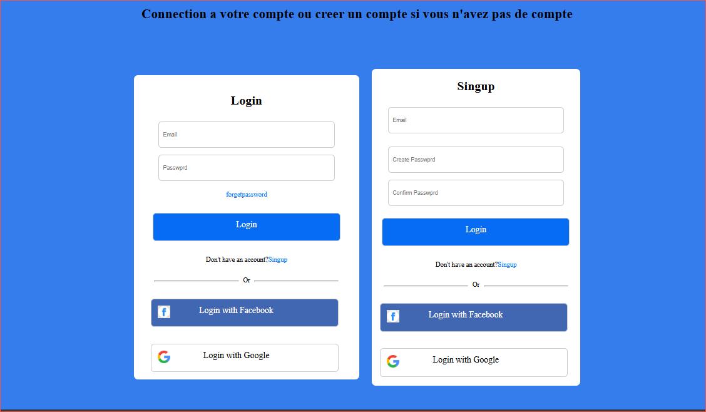

<<<<<<< HEAD
## EXERCICE HTML/CSS
Description: ce repository regroupe tous les exercices que je suis entrain d'effectuer en HTML/CSS et avec le framework du css(taiwind et Boostrap) aucour de ma formations en developpement web

## Exo1
Rendu d'une interface de connection a travers son compet gmail ou facebook
## CSS: 
 display: flex;flex-wrap: wrap;flex-direction: row; border-radius; margin,padding

## Capture en vue

## CSS: 
 display: flex;flex-wrap: wrap;flex-direction: row; border-radius; margin,padding

## Exo2
Rendu d'une interface de connection a travers son compet gmail,facebook ou intagram avec un background image 

## Capture en vue

## CSS: 
 display: flex;flex-wrap: wrap;flex-direction: row; border-radius; margin,padding

 ## Exo3
Rendu d'une interface de fourmulaire à remplir en avec css

## Capture en vue

 ## CSS: 
 display: flex;flex-wrap: wrap;flex-direction: row; border-radius; margin,padding

 ## Exo4
Rendu d'une interface de profile d'un compte utilisateur

## Capture en vue

## CSS: 
 display: flex;flex-wrap: wrap;flex-direction: row; border-radius; margin,padding

 ## Exo1-Boostrap
Rendu d'une interface de galerie d'images avec des description en utilisant du boostrap

## Capture en vue

## Css
col-12 col-sm-6 col-md-4 col-lg-3; card;
=======
## EXERCICE HTML/CSS
Description: ce repository regroupe tous les exercices que je suis entrain d'effectuer en HTML/CSS et avec le framework du css(taiwind et Boostrap) aucour de ma formations en developpement web

## Exo1
Rendu d'une interface de connection a travers son compet gmail ou facebook
## CSS: 
 display: flex;flex-wrap: wrap;flex-direction: row; border-radius; margin,padding

## Capture en vue

## CSS: 
 display: flex;flex-wrap: wrap;flex-direction: row; border-radius; margin,padding

## Exo2
Rendu d'une interface de connection a travers son compet gmail,facebook ou intagram avec un background image 

## Capture en vue

## CSS: 
 display: flex;flex-wrap: wrap;flex-direction: row; border-radius; margin,padding

 ## Exo3
Rendu d'une interface de fourmulaire à remplir en avec css

## Capture en vue

 ## CSS: 
 display: flex;flex-wrap: wrap;flex-direction: row; border-radius; margin,padding

 ## Exo4
Rendu d'une interface de profile d'un compte utilisateur

## Capture en vue

## CSS: 
 display: flex;flex-wrap: wrap;flex-direction: row; border-radius; margin,padding

 ## Exo1-Boostrap
Rendu d'une interface de galerie d'images avec des description en utilisant du boostrap

## Capture en vue

## Css
col-12 col-sm-6 col-md-4 col-lg-3; card;
>>>>>>> 5fc9777295b3b9f8ba5066754644b15d43e95819
